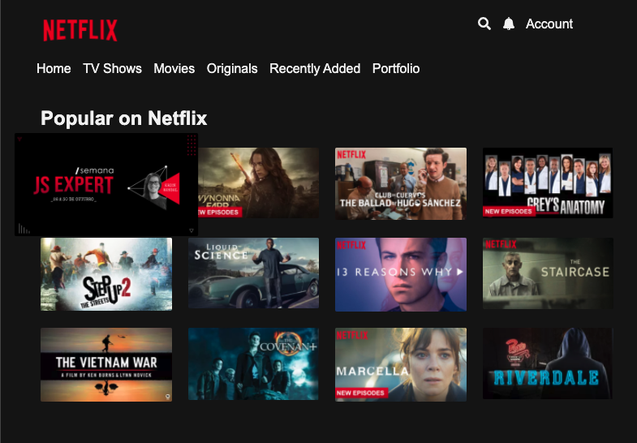

# Projeto da JS Expert Week
Projeto base desenvolvido por @ErickWendel
- Acesse o [index](./public/index/index.html) para visualizar a lista de titulos
- Acesse o [bandersnatch](./public/bandersnatch/index.html) para acessar o titulo base do projeto

## Lista de Títulos

### Créditos

- Layout da lista foi baseada no  codepen do [Carlos Avila
](https://codepen.io/cb2307/pen/XYxyeY)
- Layout do video foi baseado no codepen do [Benjamin Pott](https://codepen.io/benjipott/pen/JELELN)

### Observações: 
- Uso da biblioteca video.js, uma bibblioteca JavaScript pra trabalhar com vídeos.
- Deve-se baixar o ffmpeg e ffprobe (para desenvolvedores windows é necessário adicioná-los ao Path das variáveis de ambiente).
- ffprobe/ffmpeg --help no terminal pra ter mais informações sobre esses programas.
- Media Source Extensions não funcionam em qualquer tipo de ambiente (por exemplo, no IOs não funcionam bem)